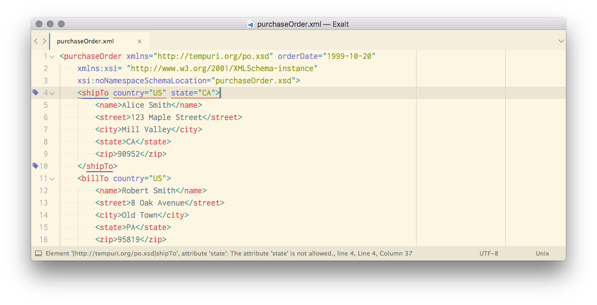

Exalt
=====

Exalt is a [Sublime Text 3] plugin for validating and formatting XML documents.



*The theme in the screenshot is [Boxy].*

## Features

### Validate files on the fly

Validate XML, XHTML, and XSLT files on the fly with [lxml]
with these validation mechanisms:

- [Document Type Definition][dtd] (DTD)
- [XML schema][xsd] (XSD)
- [RelaxNG schema][rng] (RNG)
- [Schematron schema][schematron]

Exalt supports [XML catalogs][xml-catalog] via [lxml][lxml].

#### XSLT validation

If the syntax of your current file is set to [XSLT][xslt], Exalt automatically
validates the file against
[Norman Walsh's Relax NG grammars for XSLT stylesheets][ndw].

#### XSD validation

Exalt uses the `xsi:schemaLocation` or the `xsi:noNamespaceSchemaLocation`
attribute of the root element to validate against the schema defined in that
attribute.

This means Exalt can validate [Maven][maven] POM files that look like this:

```xml
<project xmlns="http://maven.apache.org/POM/4.0.0"
         xmlns:xsi="http://www.w3.org/2001/XMLSchema-instance"
         xsi:schemaLocation="http://maven.apache.org/POM/4.0.0
                             http://maven.apache.org/maven-v4_0_0.xsd">
    <modelVersion>4.0.0</modelVersion>

    <groupId>foobar</groupId>

    . . .
</project>
```

You'll probably want to set up an [XML catalog][xml-catalog] to avoid having to
fetch schemas from the internet. See **Installing** for more information.

#### `xml-model` validation

Exalt also supports the [`xml-model`][xml-model] processing instruction. That
means that you can have a processing instruction like this before the root
element of your [DITA XML 1.2][dita] document (but *after* the XML declaration,
of course):

```xml
<?xml-model href="urn:dita-ng:dita:rng:topic.rng"
            schematypens="http://relaxng.org/ns/structure/1.0"?>
```

Exalt will validate against the schema in the `href` pseudo-attribute. It
uses the XML catalog you've set up to resolve the path in the `href`
pseudo-attribute and the `schematypens` pseudo-attribute to determine the the
type of the schema.

You can also use absolute or relative paths in the `href` pseudo-attribute:

```xml
<!-- Relax NG -->
<?xml-model href="file:///etc/xml/common/schemas/docbook/docbook-5.0/docbook.rng"
            schematypens="http://relaxng.org/ns/structure/1.0"?>

<!-- XML Schema -->
<?xml-model href="../docbook-5.0/xsd/docbook.xsd"
            schematypens="http://www.w3.org/2001/XMLSchema"?>

<!-- ISO Schematron -->
<?xml-model href="file:///etc/xml/common/schemas/dita/schematron/dita-1.2-for-xslt1.sch"
            schematypens="http://purl.oclc.org/dsdl/schematron"?>
```

If your file doesn't validate, you can press `⌘ + Ctrl + E` to jump to the
validation error if it's not already in view.

### Format XML & HTML files

Press `⌘ + Ctrl + X` to reformat (pretty-print) an XML or HTML file. If
you have nothing selected, Exalt will format the entire document. If you
have one or more selections, Exalt will format those.

**NOTE**: When formatting a selection, Exalt assumes the selection is a
well-formed XML fragment. It will try to recover, but if your selection
isn't well-formed, chances are the result is not what you want.

Exalt tries to format non-well-formed XML files via the [libxml2][libxml2]
`recover` flag.

### Schema caching

Exalt caches the schemas it uses for performance. This is useful if you're
working on XML documents that use large schemas or when the schema is stored
elsewhere than your computer.

However, this means that if you're developing a schema, the changes in the
schema will not take effect until you clear the Exalt schema cache.

To clear the schema cache, run the `Exalt: Clear Parser Cache` command via
the Sublime Text command palette. If you need to do it often, you might want
to add a keyboard shortcut for that command in the Sublime Text settings.

## Installing

1. Install Exalt via [Package Control][package-control].
2. Restart Sublime Text.
3. (*Optional, but recommended*.) In `User/Exalt.sublime-settings`, set the
   path to your [XML catalog files][xml-catalog].

    For example:

    ```json
    {
      "xml_catalog_files": ["/etc/xml/catalog", "~/.schemas/catalog.xml"]
    }
    ```

    By default, the plugin uses the catalog files defined in
    `Exalt/Exalt.sublime-settings`. Those catalog files might or might not
    exist on your system.

    If you want, you can use my [`catalogs`][catalogs] repository
    to install a set of commonly used XML catalogs and schemas. Just set the
    `xml_catalog_files` setting of this plugin to point to the `catalog.xml`
    file in where you cloned the repo.

    Alternatively, you can clone[`catalogs`][catalogs] into
    `/etc/xml` and create `/etc/xml/catalog.xml` with this content:

    ```xml
    <catalog xmlns="urn:oasis:names:tc:entity:xmlns:xml:catalog">
      <nextCatalog catalog="catalogs/catalog.xml"/>
    </catalog>
    ```

    If you do that, you don't have to set the `xml_catalog_files` setting.

    **NOTE**: If you change XML catalogs in any way, you need to restart
    Sublime Text 3 for the changes to take effect.

## Known issues

- Due to libxml2 issues [#573483][libxml2-#573483], [#753970][libxml2-#753970],
  and [#753997][libxml2-#753997], **none** of the available validation methods
  work for DITA 1.3 files.
- ISO Schematron validation doesn't always report the error position correctly.

## Acknowledgements
- Norman Walsh for his [RelaxNG grammars for XSLT stylesheets][ndw].
- @hoest for [SublimeXSLT][sublimexslt], where I borrowed `XSLT.tmLanguage`
  from.

[dita]: https://en.wikipedia.org/wiki/Darwin_Information_Typing_Architecture
[dtd]: https://en.wikipedia.org/wiki/Document_type_definition
[libxml2]: http://xmlsoft.org
[libxml2-#573483]: https://bugzilla.gnome.org/show_bug.cgi?id=573483
[libxml2-#753970]: https://bugzilla.gnome.org/show_bug.cgi?id=753970
[libxml2-#753997]: https://bugzilla.gnome.org/show_bug.cgi?id=753997
[lxml]: http://lxml.de
[catalogs]: https://github.com/eerohele/catalogs
[Boxy]: https://packagecontrol.io/packages/Boxy%20Theme
[maven]: https://maven.apache.org
[ndw]: https://github.com/ndw/xslt-relax-ng
[package-control]: https://packagecontrol.io
[py3]: https://www.python.org
[rng]: http://relaxng.org
[schematron]: http://schematron.com/
[Sublime Text 3]: http://www.sublimetext.com/3
[sublimexslt]: https://github.com/hoest/SublimeXSLT
[w3c-dtd]: http://www.w3.org/blog/systeam/2008/02/08/w3c_s_excessive_dtd_traffic/
[xml-catalog]: http://xmlsoft.org/catalog.html
[xml-model]: http://www.w3.org/TR/xml-model
[xsd]: http://www.w3.org/XML/Schema
[xslt]: http://www.w3.org/standards/xml/transformation
